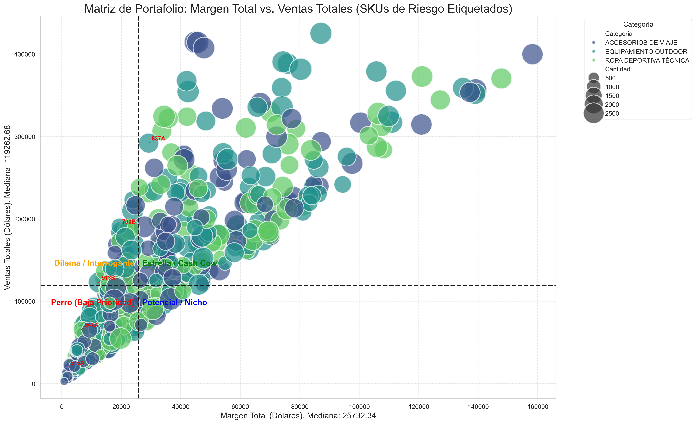
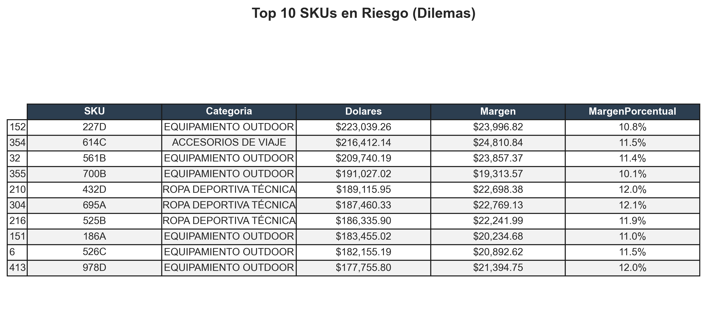

# 🚀 Consulting Express: Diagnóstico de Rentabilidad para Pymes

> **¿Tu inventario te está haciendo perder dinero?**
> Convierto tus datos de venta en decisiones estratégicas en menos de 24 horas.

---

## 💼 ¿Qué es este servicio?

Este repositorio aloja el motor de análisis de **Consulting Express**, una herramienta de auditoría financiera diseñada para dueños de negocios (Ferreterías, Farmacias, Retail) que necesitan saber **dónde está su ganancia real**.

Utilizo algoritmos de ciencia de datos para segmentar tus productos y responder 3 preguntas clave:
1.  **¿Qué productos son "Tóxicos"?** (Venden mucho pero pierden dinero).
2.  **¿Cuáles son tus "Cash Cows"?** (Tu motor de flujo de caja).
3.  **¿Qué productos deberías eliminar?** (Optimización de stock).

---

## 📸 Resultados Reales (Lo que recibirás)

Al contratar el diagnóstico, recibirás un reporte visual como este, identificando tus puntos críticos:

### 1. Matriz de Estrategia (Tu Inventario en una imagen)
Visualiza de un vistazo dónde se ubican tus productos según su rentabilidad y volumen.

### 2. Detección de Fugas de Dinero (Lista de Tóxicos)
Identifico los productos exactos que requieren revisión inmediata de precios o costos.

---

## 🛠️ ¿Cómo contratar el diagnóstico?

No necesitas saber de tecnología. Solo sigue estos 3 pasos:

1.  **Descarga la Plantilla Maestra:**
    Haz clic aquí para bajar el archivo Excel vacío:
    👉 [📥 Descargar Plantilla_Carga_ConsultingExpress.xlsx](Plantilla_Carga_ConsultingExpress.xlsx)

2.  **Llénala con tu data:**
    Solo necesito 4 columnas: SKU, Categoría, Venta Total y Costo Total.

3.  **Envíamela:**
    Manda el archivo a mi correo **[TU CORREO AQUÍ]** con el asunto "Solicitud de Diagnóstico".

**⏱️ Tiempo de entrega:** 24 horas laborables.
